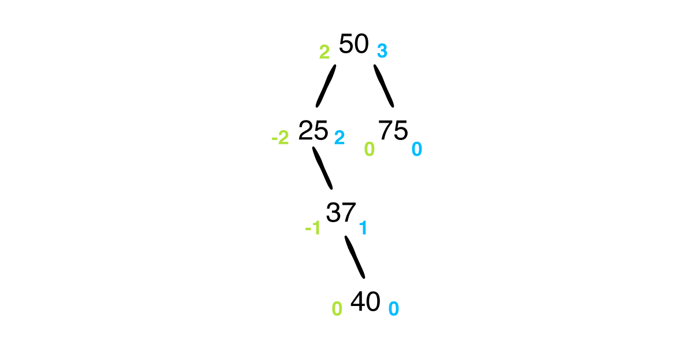
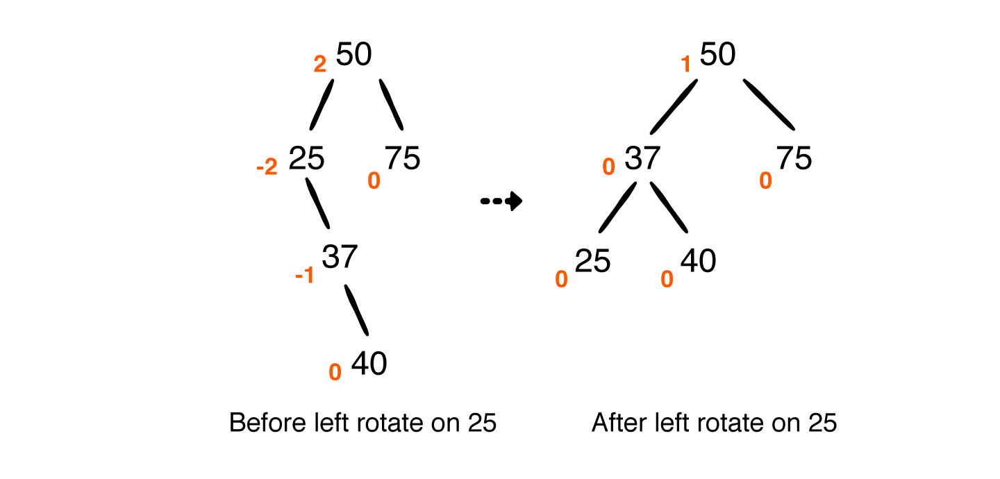
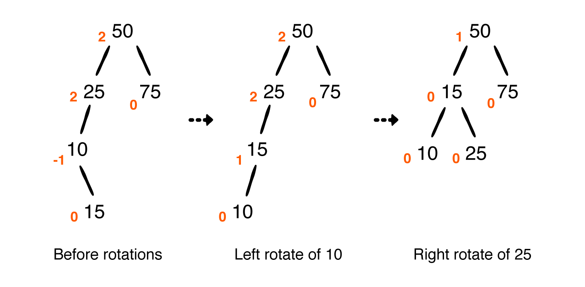

# AVL Trees

AVL is named after Georgy Adelson-Velsky and Evgenii Landis who created the first self-balancing tree. In the BST lesson a BST was built but had to be built in a balanced form from the start. An AVL will balance itself.

Types of Balance:
  - Perfect balance: This is the ideal form of an AVL Tree. Every level of the tree if filled with nodes from top to bottom including all tyhe leaves. This isn't easy to achieve because the data being inserted must be a specific size.
  
  - Good Enough Balance: This will be a degraded version of the Perfect Balance tree and will not the have the same performance. To be "Good Enough" every level must be filled except the bottom level.
  
  - Unbalanced
  


#### Balance Factor
Balance factor is a computed value of the difference between the height of the left child and the right child. If after any modification in the tree, the balance factor becomes less than −1 or greater than +1, the subtree rooted at this node is unbalanced, and a rotation is needed.



Green: Balance Factor
Blue: Height

```swift
// AVLNode<Element>
// The larger max value between the leftHeight & rightHeight
public var height = 0

public var balanceFacdtor: Int {
  return leftHeight - rightHeight
}

public var leftHeight: Int {
  return leftChild?.height ?? -1
}

public var rightHeight: Int {
  return rightChild?.height ?? -1
}
```

#### Rotation
There are 4 types of rotation:
  - Left Rotation
  - Right Rotation
  - Left-Right Rotation
  - Right-Left Rotation


Note: After the rotation that the in-order traversal has not changed & the depth of the tree is reduced by 1 level


##### Left Rotation



```swift
private func leftRotate(_ node: AVLNode<Element>) -> AVLNode<Element> {

  // Set the pivot node to the right child of the node being rotated
  let pivot = node.rightChild!

  // Take the pivot's left child and set it to the node being rotated's
  // Left child ( if nil it just sets the node's right child to nil)
  node.rightChild = pivot.leftChild

  // Move the node being rotated to the left child of the pivot
  pivot.leftChild = node

  // Set the node's new height, find the max height between the left & right children
  // And adds 1 to the node & the pivot
  node.height = max(node.leftHeight, node.rightHeight) + 1
  pivot.height = max(pivot.leftHeight, pivot.rightHeight) + 1

  // returns pivot
  return pivot
}
```

##### Right Rotation
Right rotation is the exact opposit of the left rotation


```swift
private func rightRotate(_ node: AVLNode<Element>) -> AVLNode<Element> {

  // Set the pivot node to the left child
  let pivot = node.leftChild!

  // Take the pivot's right child (even if nil) and set it to the rotated node's
  // right child
  node.leftChild = pivot.rightChild

  // Move the node being rotated to the right child of the pivot
  pivot.rightChild = node

  // Update the height of the pivot node & the rotated node
  node.height = max(node.leftHeight, node.rightHeight) + 1
  pivot.height = max(pivot.leftHeight, pivot.rightHeight) + 1

  // Return pivot
  return pivot
}
```

#### Right-Left Rotation
In previous examples the rotation was being done on a node that was all left or all right child nodes. A left-right or right-left will be a 2-step rotation.


In the above example the tree is unbalanced and the left children of the root node (50) need to be rotated. 

```swift
private func rightLeftRotate(_ node: AVLNode<Element>) -> AVLNode<Element> {

  // Verify that a right child exists else return the node
  guard let rightChild = node.rightChild else { return node }

  // Right rotate the right child
  node.rightChild = rightRotate(rightChild)

  // Left rotate & return the node
  return leftRotate(node)
}
```

#### Left-Right Rotation
Opposite of right-left rotation



```swift
private func leftRightRotate(_ node: AVLNode<Element>) -> AVLNode<Element> {

  // Verify that the left node exists else return
  guard let leftChild = node.leftChild else { return node }

  // Left rotate the left child
  node.leftChild = leftRotate(leftChild)

  // Right Rotate the node and return it
  return rightRotate(node)
}
```

#### Balance Factor

There are 3 situations to handle
  - A `balanceFactor` of 2 means the left child has more nodes than the right (right or right-left rotation)
  - A `balanceFactor` of -2 means the right child has more nodes (left or left-right rotation)
  - Default, the tree is balanced

```swift
private func balanced(_ node: AVLNode<Element>) -> AVLNode<Element> {
  switch node.balanceFactor {
    case 2:
    if let leftChild = node.leftChild,
    leftChild.balanceFactor == -1 {
      return leftRightRotate(node)
      } else {
        return rightRotate(node)
      }
      case -2:
      if let rightChild = node.rightChild,
      rightChild.balanceFactor == 1 {
        return rightLeftRotate(node)
        } else {
          return leftRotate(node)
        }
        default:
        return node
      }
    }
```

#### Insert

All the previously built functions were private, so now they need to utilized. The only reason the tree should be modified is after an insert or removal.

```swift
private func insert(from node: AVLNode<Element>?, value: Element) -> AVLNode<Element> {

  // Verifies there is a node available, if at a leaf this would be nil and it would
  // create the node and return it
  guard let node = node else {
    return AVLNode(value: value)
  }

  if value < node.value {

    // Following BST rules if the node has a less than value it will traverse
    // Down the left child
    node.leftChild = insert(from: node.leftChild, value: value)
    } else {

      // Traverse down the right child
      node.rightChild = insert(from: node.rightChild, value: value)
    }

    // Once the node is in the proper position (possibly unbalanced), the balance
    // function is run
    let balanceNode = balanced(node)

    // Update the node height
    balanceNode.height = max(balanceNode.leftHeight, balanceNode.rightHeight) + 1

    return balanceNode
}
```